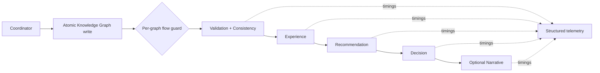

# Production Hardening and Observability

Milestone 14 protects the Coordinator-based production boundary while keeping
the platform local-first and deterministic.

## Runtime guarantees

- Knowledge Graph and Experience snapshots use atomic replace writes.
- Complete Knowledge Graph read-modify-write cycles are serialized per file.
- Only one Product Intelligence flow can use the same graph at a time; a
  bounded wait returns an observable non-blocking error to the agent.
- Graph, store, candidate, and experience-run limits are environment-backed.
- Every integrated stage emits a structured timing record and publishes its
  telemetry in `AgentContext.product_intelligence.observability`.
- Stage deadlines are soft deadlines: the elapsed time is checked immediately
  after the deterministic operation returns. They detect overruns without
  unsafe thread cancellation.



## Configuration

| Variable | Default | Purpose |
|---|---:|---|
| `PRODUCT_FLOW_STAGE_TIMEOUT_SECONDS` | `30` | Soft deadline per integrated stage |
| `PRODUCT_FLOW_LOCK_TIMEOUT_SECONDS` | `5` | Maximum wait for the per-graph flow guard |
| `PRODUCT_FLOW_MAX_GRAPH_BYTES` | `26214400` | Maximum graph accepted by Product Intelligence |
| `PRODUCT_FLOW_MAX_CANDIDATES` | `100` | Candidate admission cap per analysis |
| `PRODUCT_FLOW_MAX_EXPERIENCE_RUNS` | `50` | Historical runs processed per refresh |
| `KNOWLEDGE_GRAPH_MAX_BYTES` | `52428800` | Maximum persisted Knowledge Graph snapshot |
| `EXPERIENCE_STORE_MAX_BYTES` | `10485760` | Maximum persisted Experience snapshot |

Invalid or non-positive values fall back to safe defaults/minimums.

## Operations

Run a local readiness check:

```bash
python3 scripts/production_health.py
```

The command exits with `0` when required resources are healthy and `1` when a
required graph is missing or a size limit is exceeded. The Experience store is
allowed to be uninitialized before the first Product Intelligence run.

Logs rotate at `logs/app.log`; Product Intelligence stage entries contain a
run id, status, duration, stage name, and error type without raw dataset rows.

## CI gate

GitHub Actions compiles the source, imports/builds the dashboard in a smoke
test, and runs the full offline test suite on Python 3.11. Dependency updates
for pip and GitHub Actions are proposed monthly by Dependabot.
